# 🏍️ RedahLuhh

> Smart route weather tracker for Malaysian motorcyclists — redah tanpa ragu (ride without doubt)


---

## 📖 Table of Contents

- [Overview](#-overview)
- [Features](#-features)
- [Tech Stack](#-tech-stack)
- [Architecture](#-architecture)
- [User Flow](#-user-flow)
- [Auth Flow](#-auth--session-flow)
- [Database](#-database-erd)
- [API Structure](#-api-structure)
- [Frontend Components](#-frontend-components)
- [Feature Flows](#-feature-specific-flows)
- [Getting Started](#-getting-started)
- [Environment Variables](#-environment-variables)
- [Deployment](#-deployment)
- [Project Structure](#-project-structure)
- [Roadmap](#-roadmap)
- [License](#-license)

---

## 🧭 Overview

RedahLuhh checks the weather at every kilometre of your route — not just the destination. Enter your origin and destination, pick a departure time, and get a colour-coded (green / yellow / red) breakdown across all available routes so you can choose the driest path before you ride. It also integrates live MET Malaysia official weather warnings and a real-time GPS navigation mode that keeps your screen on while riding.

**Type:** `Solo`
**Brand:** `Luhh Series`
**Built with:** Independent

---

## ✨ Features

- ✅ Real-time weather at every waypoint along the route (not just the destination)
- ✅ Multi-route comparison — up to 3 routes ranked by weather score (driest first)
- ✅ Google Maps with colour-coded polyline (green / yellow / red per segment)
- ✅ Departure time scheduler for future trip planning + hourly forecast
- ✅ 5-provider weather cascade with automatic fallback (XWeather → Meteoblue → Tomorrow.io → Open-Meteo → WeatherAPI)
- ✅ MET Malaysia official weather warnings integrated
- ✅ Go Now full-screen navigation mode with live GPS tracking + screen wake lock
- ✅ Day/night map theme auto-switched based on Malaysia local time
- ✅ Auto-detect current location on page load
- ✅ Feedback system with public wall and admin dashboard (Supabase)
- ✅ Per-provider quota alerts with transparent active provider display
- 🚧 Saved/favourite routes *(in progress)*
- 💡 Push notifications for weather changes mid-journey *(planned)*
- 💡 Offline mode / PWA *(planned)*

---

## 🛠 Tech Stack

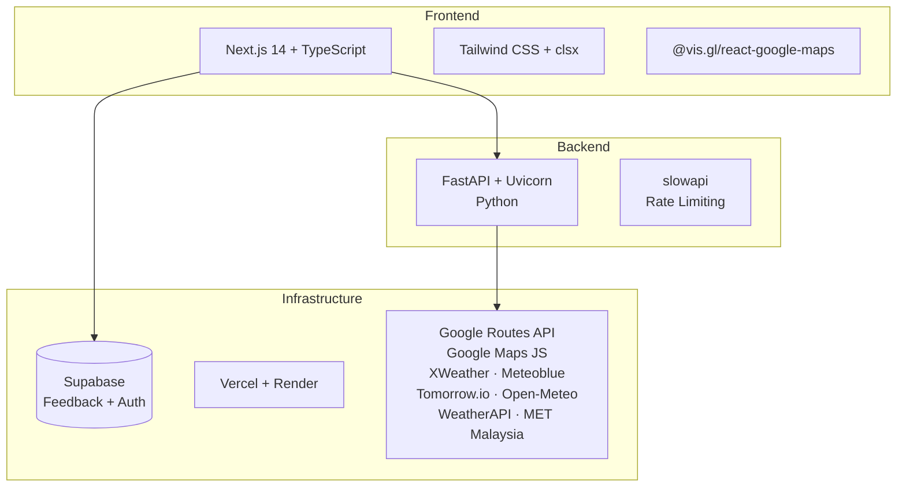

| Layer | Technology |
|---|---|
| Frontend | Next.js 14, TypeScript, Tailwind CSS |
| Backend | FastAPI, Uvicorn, Python |
| Database | Supabase (PostgreSQL) |
| Auth | Supabase Auth (admin dashboard only) |
| Hosting | Vercel (frontend), Render (backend) |
| Routing | Google Routes API, Google Maps JS + Places |
| Weather | XWeather, Meteoblue, Tomorrow.io, Open-Meteo, WeatherAPI |
| Alerts | MET Malaysia official warnings |
| Other | slowapi (rate limiting), date-fns, clsx |

---

## 📌 Architecture

### High-level Architecture

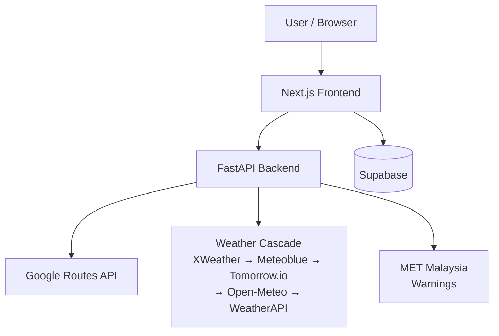

### System Architecture

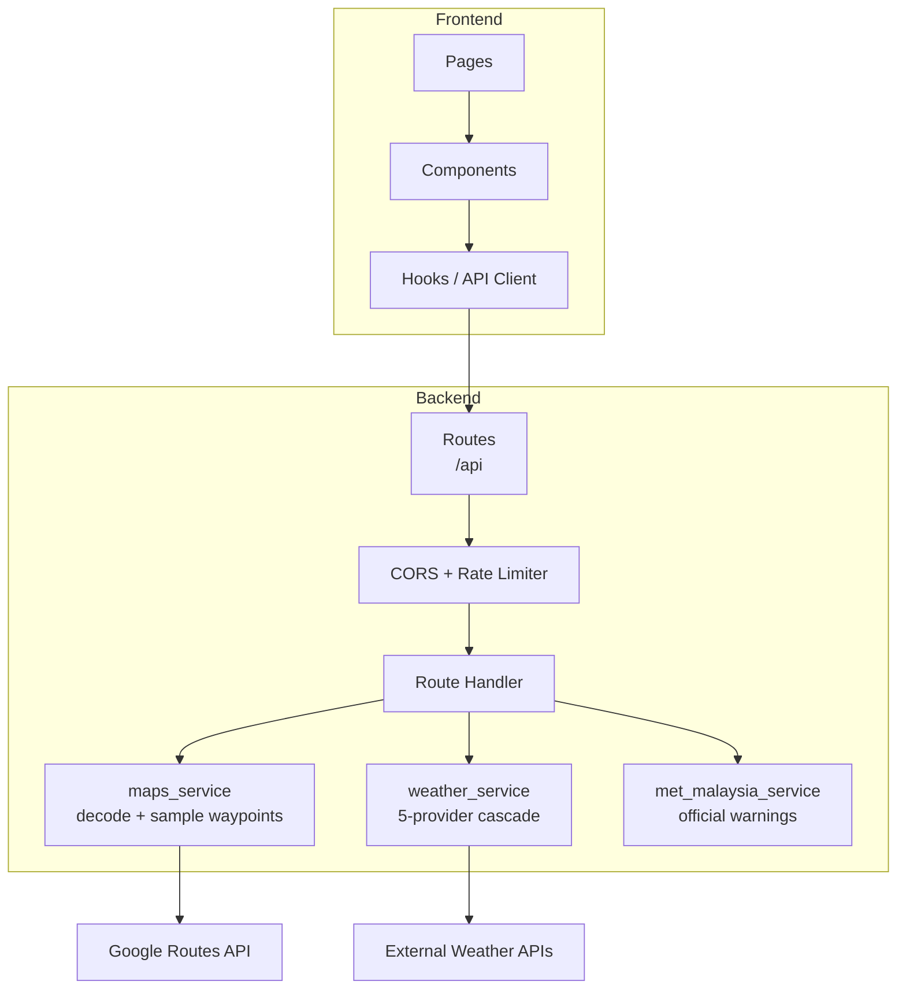

---

## 👤 User Flow

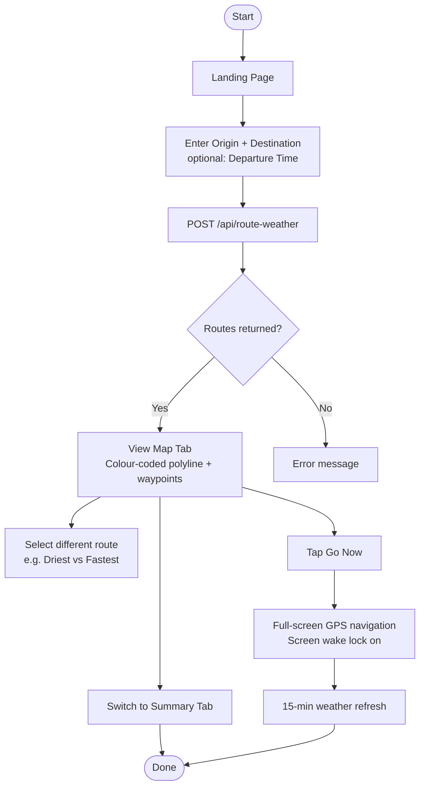

### Page Map

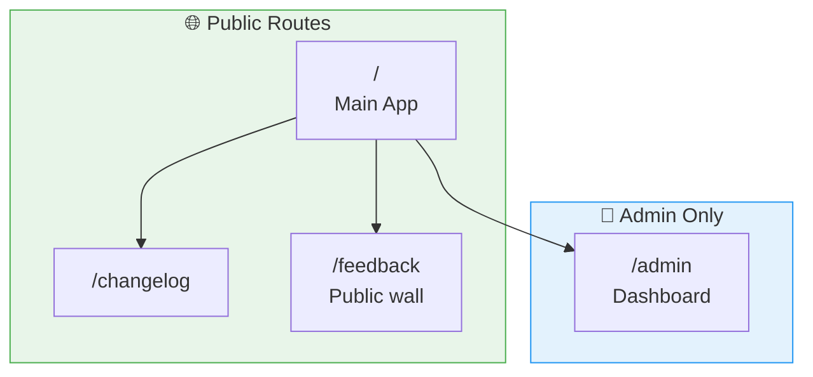

### Wireframe Overview

```mermaid
graph TD
    subgraph Home ["📄 / (Home)"]
        H1["Header: Logo + Backend status"]
        H2["Hero text (pre-search only)"]
        H3["RouteForm: origin · destination · departure"]
        H4["Route selector chips (multi-route)"]
        H5["Map | Summary tabs"]
        H6["WeatherMap / WeatherSummary"]
        H7["Mini waypoint cards (scroll)"]
        H8["Footer: version · provider"]
        H1 --> H2 --> H3 --> H4 --> H5 --> H6 --> H7 --> H8
    end

    subgraph Nav ["📄 Go Now (full-screen overlay)"]
        N1["Full-screen Google Map"]
        N2["Live GPS dot"]
        N3["Weather refresh banner"]
        N1 --> N2 --> N3
    end
```

---

## 🔐 Auth & Session Flow

> The main app requires no login — it is fully public. Auth applies only to the `/admin` dashboard, which uses Supabase email/password auth.

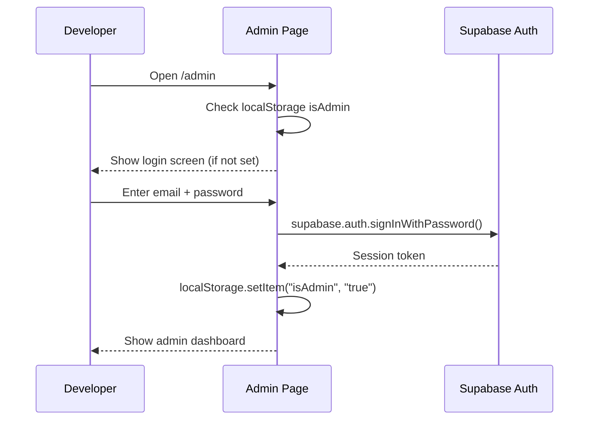

---

## 🗄️ Database (ERD)

> Supabase is used exclusively for the feedback and analytics system. Weather data is fetched live from external APIs and never stored.

### Core ERD

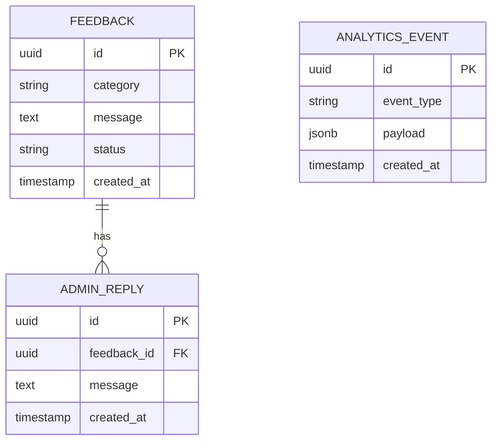

### Database Schema Overview

| Table | Purpose | Key Relations |
|---|---|---|
| `feedback` | User-submitted bug reports, enhancements, testimonials | — |
| `admin_reply` | Developer replies to feedback entries | belongs to `feedback` |
| `analytics_event` | Page views and interaction events | — |

---

## 🔌 API Structure

### API Structure

```mermaid
graph TD
    API[FastAPI]
    API --> Meta[meta]
    API --> WR[/api]

    Meta --> M1[GET /health]
    Meta --> M2[GET /api/provider-status]
    Meta --> M3[GET /api/debug-weather]

    WR --> W1[POST /api/route-weather]
```

### Endpoint Reference

| Method | Endpoint | Description |
|---|---|---|
| `GET` | `/health` | Service health check |
| `GET` | `/api/provider-status` | Active weather provider + exhaustion flags |
| `GET` | `/api/debug-weather?lat=&lon=` | Test WeatherAPI at a coordinate |
| `POST` | `/api/route-weather` | Main endpoint — returns weather for all routes |

### Request/Response Flow

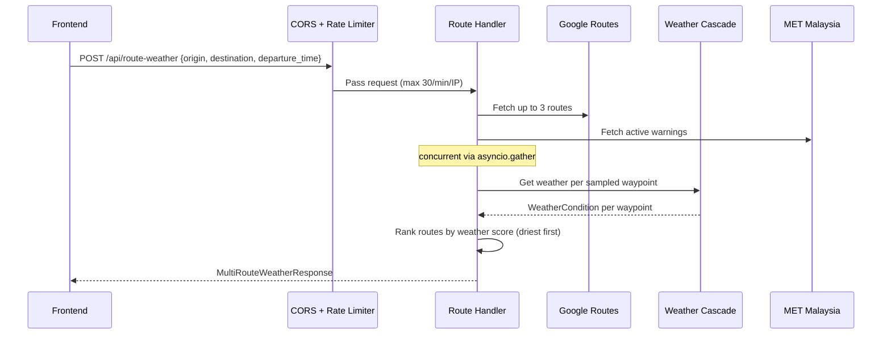

---

## 🧩 Frontend Components

### Component Tree

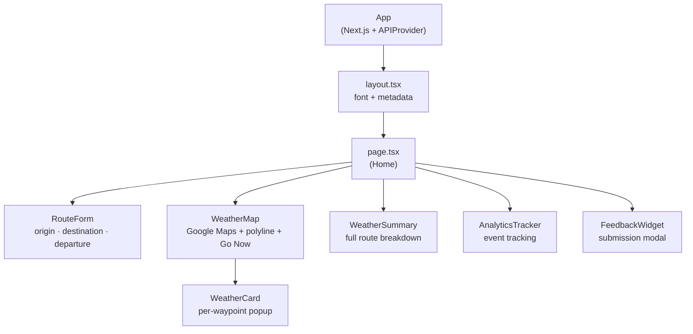

### Key Components

| Component | Purpose |
|---|---|
| `RouteForm` | Origin + destination autocomplete and optional departure time picker |
| `WeatherMap` | Google Maps with colour-coded polyline, emoji waypoint markers, and Go Now full-screen navigation |
| `WeatherCard` | Individual waypoint weather detail popup on the map |
| `WeatherSummary` | Full-route breakdown: overall status, waypoint list, MET warnings, alerts |
| `FeedbackWidget` | Floating feedback button + submission modal (writes to Supabase) |
| `AnalyticsTracker` | Passive event tracker (writes to Supabase) |

---

## ⚙️ Feature-specific Flows

### Weather Cascade Flow

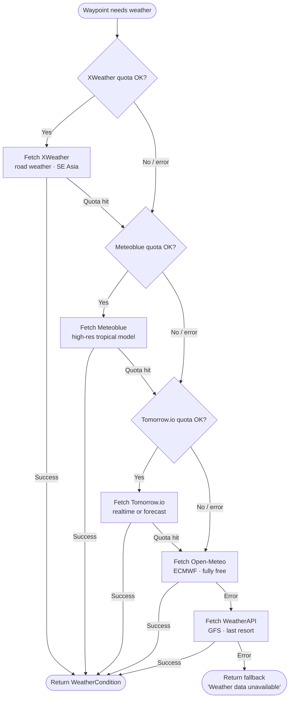

### Go Now Navigation Flow

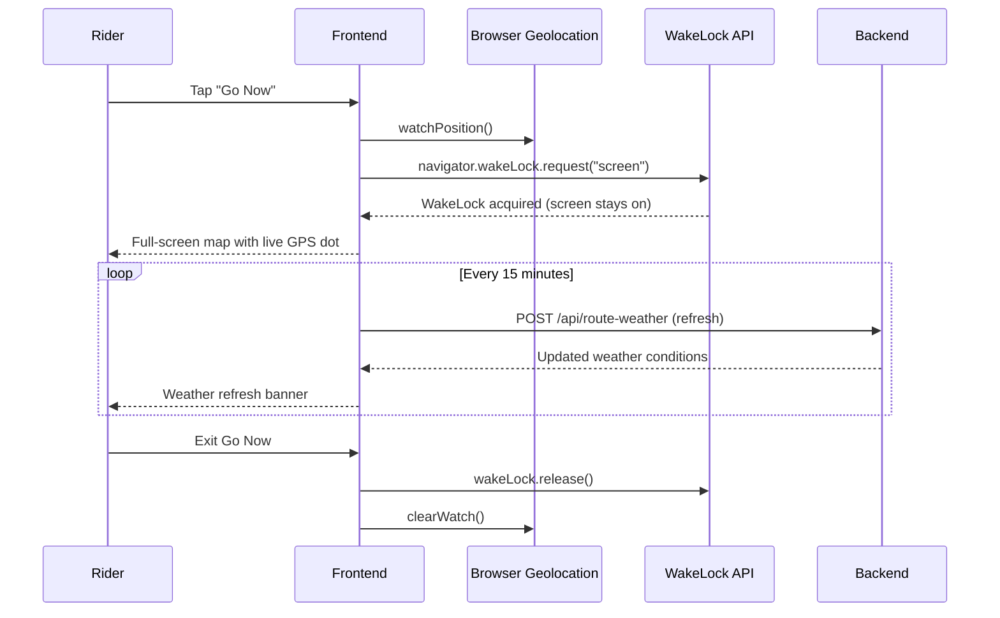

### Route Ranking Flow

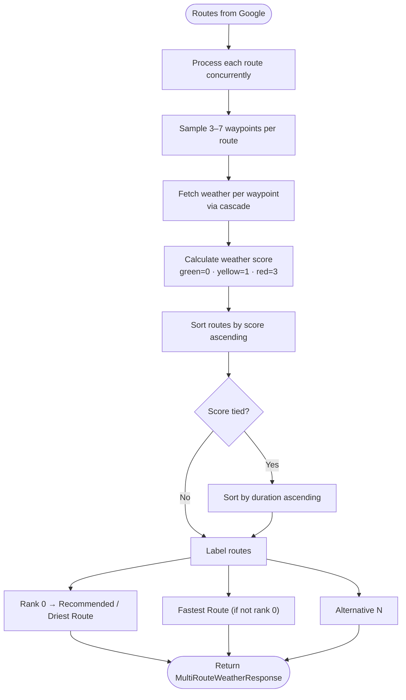

---

## 🚀 Getting Started

### Prerequisites

- Node.js `>=18`
- Python `>=3.11`
- Docker + Docker Compose *(optional)*

### Installation

```bash
git clone https://github.com/syaqirah/RedahLuhh.git
cd RedahLuhh
```

### Running locally

```bash
# Backend
cd backend
python -m venv .venv && source .venv/bin/activate
pip install -r requirements.txt
uvicorn app.main:app --reload --port 8000

# Frontend (separate terminal)
cd frontend
npm install
npm run dev
```

### Running with Docker

```bash
# Development
docker compose up --build
```

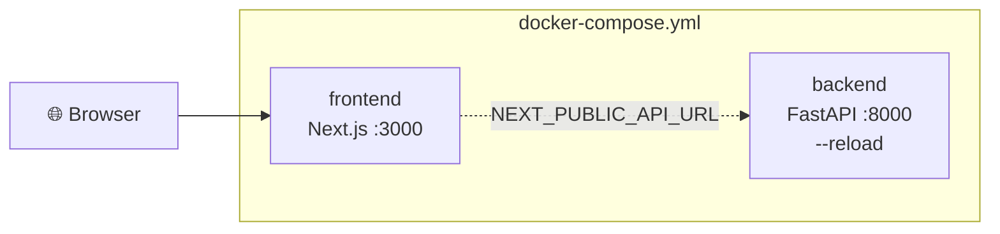

| Service | Dev URL |
|---|---|
| Frontend | http://localhost:3000 |
| Backend | http://localhost:8000 |
| API Docs | http://localhost:8000/docs |

---

## 🔑 Environment Variables

### Backend (`backend/.env`)

```env
# Google
GOOGLE_MAPS_API_KEY=

# Weather providers (cascade order)
XWEATHER_CLIENT_ID=
XWEATHER_CLIENT_SECRET=
METEOBLUE_API_KEY=
TOMORROW_API_KEY=
WEATHERAPI_KEY=

# CORS
CORS_ORIGINS=["http://localhost:3000"]
```

### Frontend (`frontend/.env.local`)

```env
NEXT_PUBLIC_GOOGLE_MAPS_API_KEY=
NEXT_PUBLIC_API_URL=http://localhost:8000

# Supabase (feedback + admin auth)
NEXT_PUBLIC_SUPABASE_URL=
NEXT_PUBLIC_SUPABASE_ANON_KEY=
```

> Copy `backend/.env.example` and `frontend/.env.local.example` and fill in your values.

---

## ☁️ Deployment

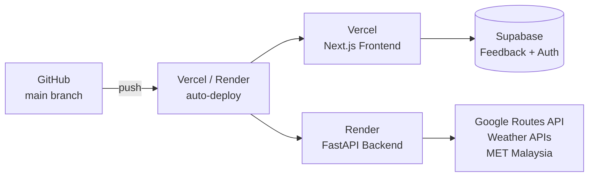

| Service | Platform | Notes |
|---|---|---|
| Frontend | Vercel | Auto-deploy on push to `main` |
| Backend | Render | Free tier — ~30 s cold start on first request |
| Database | Supabase | Managed PostgreSQL + Auth |

---

## 📁 Project Structure

```
RedahLuhh/
├── docker-compose.yml
│
├── frontend/
│   ├── src/
│   │   ├── app/
│   │   │   ├── page.tsx          # Main app (home)
│   │   │   ├── layout.tsx
│   │   │   ├── changelog/
│   │   │   ├── feedback/
│   │   │   └── admin/
│   │   ├── components/
│   │   │   ├── RouteForm.tsx
│   │   │   ├── WeatherMap.tsx
│   │   │   ├── WeatherCard.tsx
│   │   │   ├── WeatherSummary.tsx
│   │   │   ├── FeedbackWidget.tsx
│   │   │   └── AnalyticsTracker.tsx
│   │   ├── hooks/
│   │   │   ├── useRouteWeather.ts
│   │   │   └── useBackendHealth.ts
│   │   └── lib/
│   │       ├── api.ts
│   │       ├── supabase.ts
│   │       └── types.ts
│   └── [config files]
│
└── backend/
    └── app/
        ├── main.py
        ├── config.py
        ├── models/
        │   └── schemas.py
        ├── routers/
        │   └── weather_route.py
        └── services/
            ├── maps_service.py
            ├── weather_service.py
            └── met_malaysia_service.py
```

---

## 🗺 Roadmap

- [x] Real-time weather along entire route (v0.1.0)
- [x] Multi-route comparison with weather scoring (v0.2.0)
- [x] Departure time scheduler + hourly forecast (v0.2.0)
- [x] 5-provider weather cascade with automatic fallback (v0.3.0)
- [x] Go Now full-screen navigation + screen wake lock (v0.3.0)
- [x] MET Malaysia official weather warnings (v0.3.0)
- [x] Feedback system with admin dashboard (v0.3.0)
- [ ] Saved/favourite routes
- [ ] Push notifications for weather changes mid-journey
- [ ] Offline mode / PWA support

---

## 📄 License

[MIT](LICENSE) © 2025 Syaqirah
